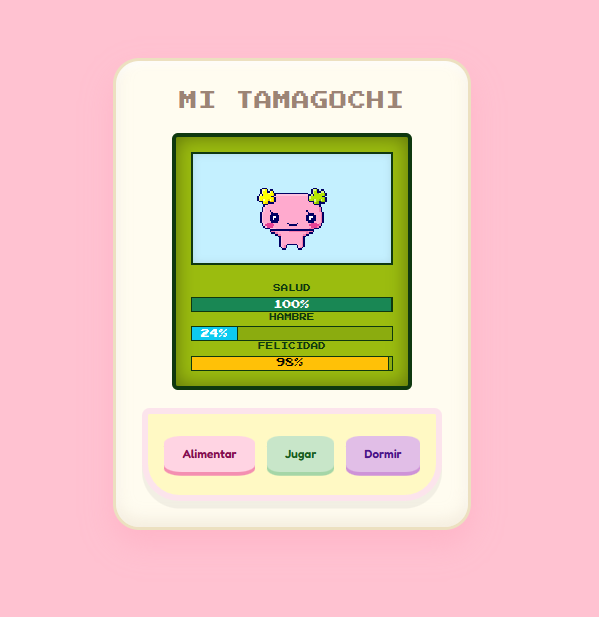

<div align="center">

# 🐣 Tamagotchi Virtual Life 💖
### Tu mascota virtual dockerizada y lista para jugar



<br/>


<br/>

<b>Proyecto Fullstack con arquitectura de microservicios, ejecutable en cualquier entorno gracias a Docker.</b>  
Desarrollado con ☕ y mucho código.

</div>

---

## ✨ Descripción

**Tamagotchi Virtual Life** es una simulación de mascota virtual en la que deberás cuidar a tu compañero digital manteniendo su salud, felicidad y energía.

Si descuidas sus necesidades, su estado disminuirá progresivamente. El objetivo es mantener el equilibrio y evitar que su salud llegue a niveles críticos.

El proyecto está construido siguiendo una arquitectura moderna basada en microservicios:

- 🧠 **Backend:** Python + FastAPI  
- 👀 **Frontend:** React Native con Expo (modo Web)  
- 🐳 **Infraestructura:** Docker + Docker Compose  

---

## 🚀 Puesta en marcha

### Requisitos

Solo necesitas tener instalado:

- Docker  
- Docker Compose  

No es necesario instalar Python ni Node.js manualmente.

---

### 1️⃣ Clonar el repositorio

```bash
git clone https://github.com/TU_USUARIO/TU_REPO.git
cd TU_REPO
```

---

### 2️⃣ Construir y ejecutar el proyecto

Desde la raíz del proyecto (donde se encuentra `docker-compose.yml`), ejecuta:

```bash
docker compose up --build
```

> ⚠️ La primera ejecución puede tardar varios minutos debido a la descarga de dependencias.

---

## 🎮 Acceso a la aplicación

Una vez iniciado correctamente:

| Servicio        | URL                         | Descripción |
|---------------|----------------------------|-------------|
| 🏠 Aplicación | http://localhost:8001      | Interfaz del juego |
| 📚 API Docs   | http://localhost:8000/docs | Documentación Swagger del backend |

---

## 🕹️ Funcionalidades

- 🍔 **Alimentar:** Reduce el hambre y mejora la salud.
- 🎾 **Jugar:** Aumenta la felicidad.
- 💤 **Dormir:** Recupera energía.
- 📉 Sistema automático de degradación de estado con el paso del tiempo.

---

## 🛠️ Tecnologías utilizadas

- **React Native / Expo** → Desarrollo de interfaz multiplataforma (Web & Mobile).
- **FastAPI** → Framework backend de alto rendimiento en Python.
- **Docker & Docker Compose** → Contenerización y orquestación.
- **Vite** → Servidor de desarrollo rápido para frontend.

---

## 📂 Estructura del proyecto

```
📦 tamagotchi-project
 ┣ 📂 backend
 ┃ ┣ 📜 Dockerfile
 ┃ ┗ 📜 main.py
 ┣ 📂 frontend
 ┃ ┣ 📜 Dockerfile
 ┃ ┗ 📂 src
 ┣ 📜 docker-compose.yml
 ┗ 📜 README.md
```


---

<div align="center">

👩‍💻 **Autor:** Laura y Adrian  


</div>
